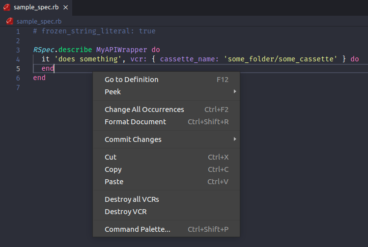

  
   
  Easy way to destroy VCR cassettes.

## Features

This extension finds and removes cassette files. There is an option to remove a specific cassette or all cassettes found in the opened editor.

Just select a line with cassette_name and click in Destroy VCR

> Warning: Until now, this extension searches for cassettes filenames with patterns demonstrated in the image, if you use in another way, we will have to implement it ;)

## Extension Settings

This extension contributes the following settings:

* `vcr-cleaner.cassettesDirectory`: specifies the folder path containing the vcr cassettes.
* `vcr-cleaner.cassetteExtension`: specifies extension for a vcr cassette.

## Known Issues

- There are other ways to define a cassette_name that have not yet been implemented.
- Limit the 'Destroy VCR' menu to appear only when there is a cassette on the selected line

## Release Notes

### 0.0.5

- New icon, readme and configurations

### 0.0.4

- Adds the possibility to destroy all vcr cassettes

### 0.0.3

- First usable version

### 0.0.1

- Initial release

----------------------------------------

**Enjoy!**